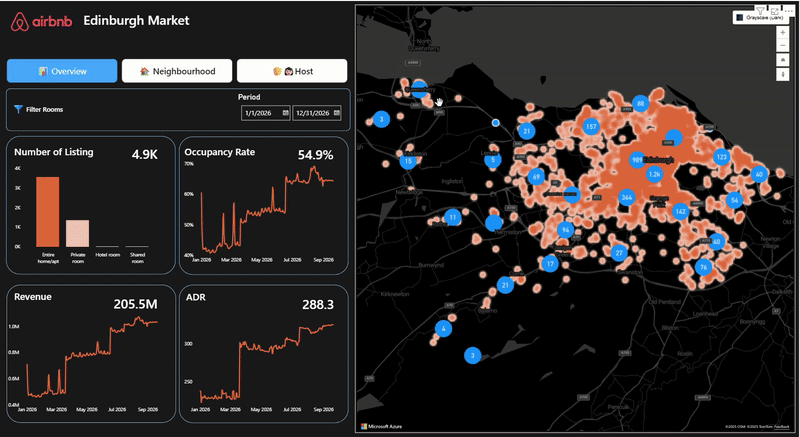
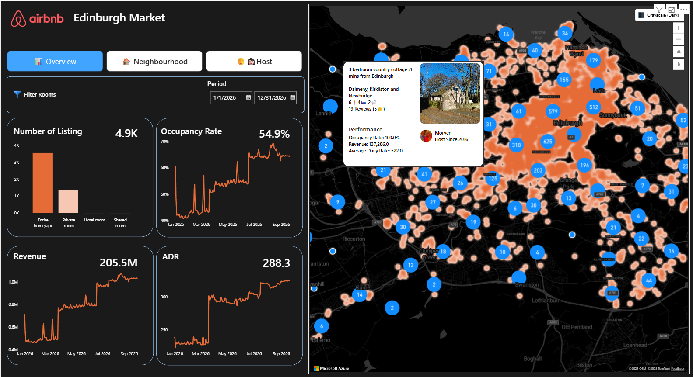
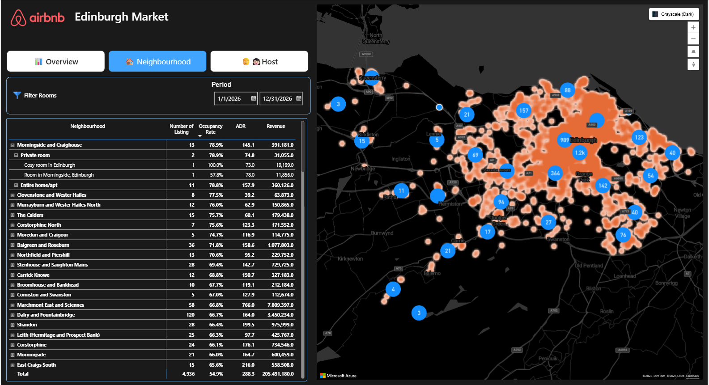
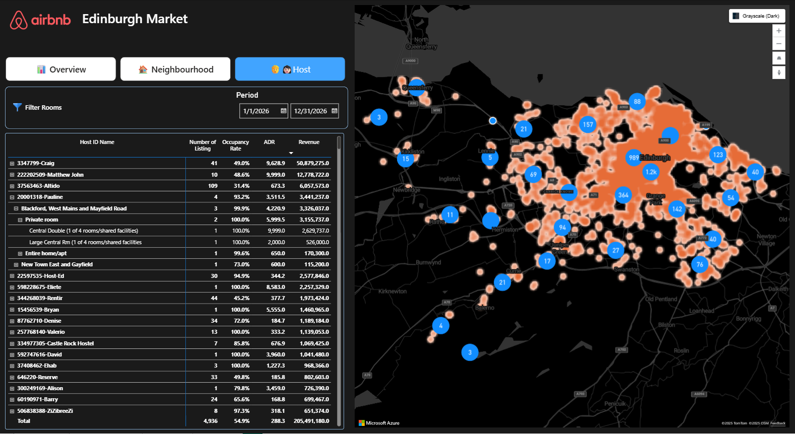

# Edinburgh Airbnb Market Analytics with Power BI

This personal project is my way of challenging myself to deepen my Power BI skills, particularly in map visualizations and dashboard management using bookmarks.

## Preview

</img>

The main objective of this dashboard is to present data and insight regarding Airbnb presence and market penetration in Edinburgh, Scotland. The following key metrics are featured in the dashboard:

* Number of listing, both available and unavailable
* Occupancy rate of the properties in Edinburgh
* Average Daily Rate (ADR)
* Revenue generated based on availability status

Based on these metrics, the dashboard allows you to gain the following insights:

* Distribution of listings across neighbourhoods in Edinburgh.
* Overall occupancy rate, ADR, and revenue, either for the entire area, specific neighbourhoods, or individual listings and hosts
* Market performance and pricing variations based on the presence of notable amenities (e.g., Wifi, TV, Kitchen, etc.)
* Average Daily Rate (ADR) comparison across property types (entire home, private room, shared room).
* Occupancy patterns, including days of the week or months with highest occupancy.
* Identification of major players in the market: hosts with the most listings, highest occupancy rates, or highest revenues
* Superhost performance compared to regular hosts.

## Dashboard

The following is the general explanation for the content of each page in the dashboard.

### 📊 Overview

The `Overview` page shows the general summary of the market and highlight the trend of the key metrics.

</img>

### 🏠 Neighbourhood

The `Neighbourhood` page allows you to see the number of listing and performance of each neighbourhood in Edinburgh. You can drill down further to gain info on the performance of each room type and each listing.

</img>

### 🧑👩🏻Host

The `Host` page shows you the number of listing and performance of each host. You can drill down further on each host to gain more info about where their listing is located, what type of room they rented, and the name of the listing itself.

</img>

## 💾 Data 

### Raw Data

The dataset was acquired from [Inside Airbnb](https://insideairbnb.com/get-the-data/) and is based on listings in Edinburgh, Scotland, United Kingdom. The data were scrapped on 21 September 2025, covering listing availability from September 2025 to September 2026 (next 365 days). The raw data consists of:

* listings: detailed information about each listing and its respective host
* calendar: the availibility of each listing for each date

### Data Preprocessing

The following are summary of processing the raw data into more proper format before entering the Power BI:

* listing

    * Split listing into three different tables: `dim_listing`, `dim_host`, and `dim_amenities`. All processed tables are located in `clean_data/`.
    * The `dim_amenities` dataset contains information of amenities provided by each listing id (e.g., Wifi, TV, Kitchen, etc).
    * The `dim_listing` dataset contains detailed information about each listing, including name, property type, room type, neighbourhood, price, number of reviews, and more. I also added notable amenities, such as Wifi and Kitchen, as logical columns to enable filtering in Power BI.
    * The `dim_host` dataset contains information about the host, including `host_id`, host name, host since, is the host a superhost, etc.

* calendar

    * Remains the same as a single dataset named `fact_calendar`.
    * Drop `price` and `adjusted_price` since both columns is empty. Daily rate and revenue calculation will be based on price information from listing.

## 🏃 Running the App Locally

With Power BI installed, simply open `airbnb_market.pbix` to dive into the dashboard and explore its visuals and insights firsthand.

## 😀 Your Feedback

Do you have a suggestion for improvement? Feel free to give any feedback to me.